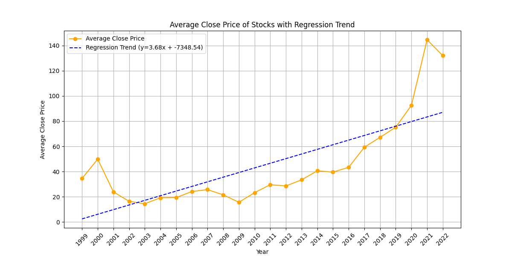

## **Calculations**

All calculations  are performed using Spark SQL functions with a test CSV file. The following sections describe the specific Spark operations used in different analyses.


## **Average Price Calculation**

This function calculates the average close price per year from a CSV file. It uses the Spark DataFrame API to read, process, and save the results.

```python
from pyspark.sql import SparkSession
from pyspark.sql.functions import col, avg, year, to_date

def average_close_per_year(input_path, output_path):
    spark = SparkSession.builder.appName("AverageClosePerYear").getOrCreate()
    
    # Read the CSV file as DataFrame
    df = spark.read.csv(input_path, header=True, inferSchema=True)

    # Convert 'Date' column to date type with the format 'DD-MM-YYYY'
    df = df.withColumn("Date", to_date(col("Date"), "dd-MM-yyyy"))

    # Filter rows where 'Date' is not null
    df = df.filter(df["Date"].isNotNull())

    # Calculate the average close price per year
    average_close_per_year = (
        df.withColumn("Year", year(col("Date")))
          .groupBy("Year")
          .agg(avg("Close").alias("AverageClose"))
          .orderBy("Year")
    )

    # Save the result in the output directory
    average_close_per_year.write.mode("overwrite").csv(output_path, header=True)

    spark.stop()
```

### **Explanation**

- **Reads a CSV file** and converts the `Date` column to a proper date format (`DD-MM-YYYY`).
- **Filters out rows** where the `Date` is null.
- **Groups data by `Year`** and calculates the **average `Close` price**.
- **Saves the output** to a CSV file in the specified output directory.

### **Analysis**



### **General Trend**  
The graph shows the average annual close prices from **1999 to 2022**. There is a steady upward trend, represented by the **regression line** (blue).

### **Regression Line**  
The regression equation is **y = 3.68x - 7348.54**, indicating an annual increase of approximately **3.68 units**. The positive slope suggests a gradual rise in average close prices over time.


## **Data organization**

This function computes annual statistics from a CSV file. It uses the Spark DataFrame API to read, process, and save the results.


```python
from pyspark.sql import SparkSession
from pyspark.sql.functions import col, year, avg, min, max, to_date

def reorganize_data(input_path, output_path):
    spark = SparkSession.builder.appName("DataOrganization").getOrCreate()

    df = spark.read.csv(input_path, header=True, inferSchema=True)
    df = df.withColumn("Date", to_date(col("Date"), "dd-MM-yyyy")) \
           .withColumn("Year", year(col("Date")))

    # Calcular estadísticas anuales
    annual_stats = (
        df.groupBy("Year")
          .agg(
              avg("Close").alias("AvgClose"),
              min("Close").alias("MinClose"),
              max("Close").alias("MaxClose"),
              avg("Volume").alias("AvgVolume")
          )
    )
    annual_stats.write.mode("overwrite").csv(output_path, header=True)
    spark.stop()

```

### **Analysis**


### **Explanation**

- **Reads a CSV file** and infers the schema, converting the Date column to a proper date format (dd-MM-yyyy)..
- **Adds a new column Year** extracted from the converted Date column.
- Groups the data by **Year** and calculates:
  - **Average**, **minimum**, and **maximum** of the **Close** prices.
  - **Average** of the **Volume**.
- Saves the processed annual statistics to a **CSV** file in the specified output directory, **overwriting** any existing data.


## **Inverted Index Calculation**

This function extracts the maximum “Close” price for each year from a CSV file, identifies the corresponding dates, and organizes them into separate groups for each year. The results are then saved as a new CSV file, containing the year, the maximum “Close” price, and the dates.


```python
from pyspark.sql import SparkSession
from pyspark.sql.functions import col, year, max, collect_list, to_date, concat_ws

def inverted_index_max_close(input_path, output_path):
    spark = SparkSession.builder.appName("InvertedIndexMaxClose").getOrCreate()

    # Leer el archivo CSV de entrada
    df = spark.read.csv(input_path, header=True, inferSchema=True)

    # Convertir la columna "Date" a formato de fecha y extraer el año
    df = df.withColumn("Date", to_date(col("Date"), "dd-MM-yyyy")) \
           .withColumn("Year", year(col("Date")))

    # Crear alias para el DataFrame original y el DataFrame de máximos
    df_alias = df.alias("df")
    max_close = df.groupBy("Year").agg(max("Close").alias("MaxClose")).alias("max_close"

    inverted_index = (
        df_alias.join(max_close, (df_alias["Year"] == max_close["Year"]) & (df_alias["Close"] == max_close["MaxClose"]))
          .groupBy(df_alias["Year"], max_close["MaxClose"])
          .agg(collect_list(df_alias["Date"]).alias("Dates"))
          .select(df_alias["Year"], max_close["MaxClose"], "Dates")
    )
    inverted_index = inverted_index.withColumn("Dates", concat_ws(", ", col("Dates")))

    # Guardar el resultado en formato CSV
    inverted_index.write.mode("overwrite").csv(output_path)

    # Detener SparkSession
    spark.stop()


```

### **Explanation**

- **Reads** a CSV file into a **PySpark DataFrame** and converts the **Date** column to `dd-MM-yyyy`, adding a **Year** column.
- Calculates the **maximum "Close"** price for each **year**.
- **Joins** the original data with the maximum values to find **dates** corresponding to the maximum **"Close"** price.
- **Groups by** Year and MaxClose, aggregating matching **dates** into a **comma-separated string**.
- **Saves** the result (**Year**, **MaxClose**, **Dates**) to a **CSV file** and stops the Spark session.

### **Analysis**


The general trend of the graph shows a significant increase in the maximum close price over the years, with some fluctuations along the way


## **Advanced Analysis Calculation**

This function delves into advanced stock data analysis, computing annual statistics and ranking years based on their average “Close” price. It further filters the top three years, examines cumulative price trends, and saves the results in CSV files.


```python
from pyspark.sql import SparkSession
from pyspark.sql.functions import col, avg, max, min, row_number, sum, year, to_date
from pyspark.sql.window import Window

def advanced_analysis(input_path, output_path):
    spark = SparkSession.builder.appName("AdvancedAnalysisForGraphs").getOrCreate()

    # Leer y preparar el dataset
    df = spark.read.csv(input_path, header=True, inferSchema=True)
    df = df.withColumn("Date", to_date(col("Date"), "dd-MM-yyyy")) \
           .withColumn("Year", year(col("Date")))

    # Calcular estadísticas anuales
    annual_stats = (
        df.groupBy("Year")
          .agg(
              avg("Close").alias("AvgClose"),
              max("Close").alias("MaxClose"),
              min("Close").alias("MinClose")
          )
    )

    # Rankeo de los años por promedio de cierre
    window_spec = Window.orderBy(col("AvgClose").desc())
    ranked_years = (
        annual_stats.withColumn("Rank", row_number().over(window_spec))
                    .filter(col("Rank") <= 3)  # Seleccionar los 3 años con mayor promedio
    )

    # Guardar ranked_years en un archivo CSV
    ranked_years.write.mode("overwrite").option("header", "true").csv(f"{output_path}/ranked_years")

    # Filtrar datos solo para los años seleccionados
    top_years = [row["Year"] for row in ranked_years.collect()]
    filtered_df = df.filter(col("Year").isin(top_years))

    # Calcular la tendencia acumulativa de precios para cada año
    trend_analysis = (
        filtered_df.select("Year", "Date", "Close")
                   .orderBy("Year", "Date")
                   .withColumn("CumulativeClose", sum("Close").over(Window.partitionBy("Year").orderBy("Date")))
    )

    # Guardar trend_analysis en un archivo CSV
    trend_analysis.write.mode("overwrite").option("header", "true").csv(f"{output_path}/trend_analysis")

    # Detener la sesión de Spark
    spark.stop()
```

### Explanation

- **Reading and Preparing Data**  
  - Reads a **CSV** file and converts the **Date** column to the format `dd-MM-yyyy`.  
  - Adds an additional **Year** column.

- **Calculating Annual Statistics**  
  - Computes annual statistics for the **Close** prices:  
    - **Average**  
    - **Maximum**  
    - **Minimum**

- **Ranking Years**  
  - Ranks the years by the **average Close price** and selects the **top 3 years**.

- **Cumulative Trend Analysis**  
  - Filters the data for the **top 3 years** and calculates the cumulative **Close** price trend for each year.

- **Saving Results**  
  - Saves the ranked years and trend analysis to **separate CSV files**.  
  - Stops the **Spark** session.


### **Analysis**


- **Upward Trend**: The graph shows a general **upward trend** in both **Close** and **cumulative prices**.

- **Cumulative Growth**: Cumulative prices **increase faster**, indicating substantial **value accumulation**.

- **Average Price Variation**: Average prices **decrease** from **Rank 1** to **Rank 3**.

## **Filter**

This function filters the dataset by allowing the user to input a minimum Close price and calculates the average Close per year. Saves the filtered results (with average Close greater than the minimum value) to a CSV file.


```python
from pyspark.sql import SparkSession
from pyspark.sql.functions import col, avg, year, to_date

def filter_by_number(input_path, output_path):
    spark = SparkSession.builder.appName("FilterByMinClose").getOrCreate()
    df = spark.read.csv(input_path, header=True, inferSchema=True)

    while True:
        try:
            min_close = float(input("Introduce el precio mínimo para filtrar los valores de 'Close': "))
            break
        except ValueError:
            pass

    df = df.withColumn("Date", to_date(col("Date"), "dd-MM-yyyy"))
    df = df.filter(df["Date"].isNotNull())

    average_close_per_year = (
        df.withColumn("Year", year(col("Date")))
          .groupBy("Year")
          .agg(avg("Close").alias("AverageClose"))
          .orderBy("Year")
    )
    
    filtered_df = average_close_per_year.filter(col("AverageClose") > min_close)
    filtered_df.write.mode("overwrite").csv(output_path, header=True)

    spark.stop()
```

### Explanation
- **User Input and Filtering**:  
  - Prompts the user to input a **minimum Close price**.  
  - Filters the dataset based on the **average Close price per year**.

- **Saving Results**:  
  - Saves the filtered results (where **AverageClose** is greater than the given value) to a **CSV file**.


## **Conclusion**

In this analysis, Spark SQL functions and the Spark DataFrame API were utilized to process and analyze stock market data efficiently. The various tasks included:

1. **Data Preparation**:  
   - Reading CSV files and converting dates to the `dd-MM-yyyy` format.
   - Adding a **Year** column for annual aggregations.

2. **Annual Statistics**:  
   - Calculating annual statistics such as average, minimum, and maximum **Close** prices, along with average **Volume**.
   - Ranking years based on average **Close** prices and selecting the **top 3** years for detailed analysis.

3. **Trend Analysis**:  
   - Identifying cumulative growth trends and creating regression models to visualize upward trends in **Close** prices.
   - Showing how cumulative prices reflect significant value accumulation over time.

4. **Inverted Index Calculation**:  
   - Extracting the maximum **Close** prices for each year and associating them with the respective dates.

5. **User-Driven Filtering**:  
   - Allowing interactive filtering based on a user-defined minimum **Close** price and saving the filtered results.

The results were visualized through graphs showing annual trends, cumulative growth, and variations in maximum and average **Close** prices. This comprehensive approach highlights the capabilities of Spark for scalable data processing and insightful stock market analysis.


